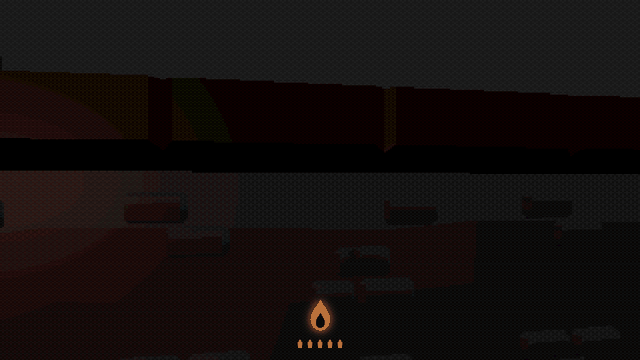
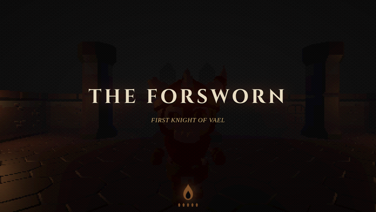
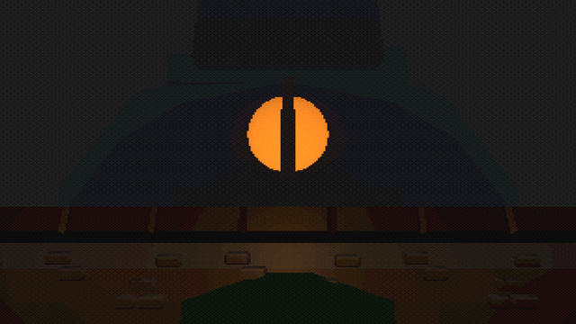
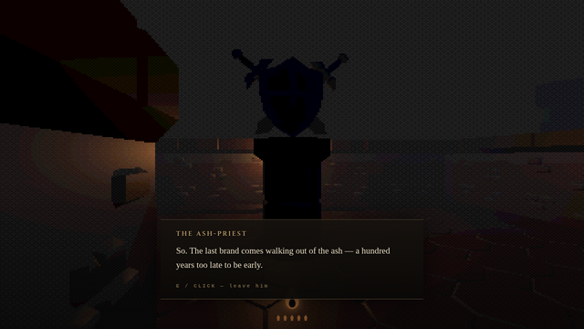
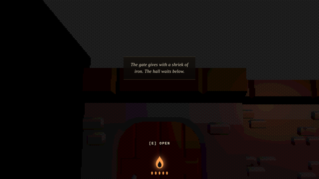

<div align="center">

# OATHBRAND

*A 30-minute PS1-style dark fantasy. The kingdom is dead. The oath is not.*

<a href="https://skeletont638-code.github.io/oathbrand/"></a>

**[Play free in your browser](https://skeletont638-code.github.io/oathbrand/)** — no download · about 30 minutes · best with keyboard &amp; mouse

<a href="https://skeletont638-code.github.io/oathbrand/"></a>

<sub>The Ashen Gate — the fog thins, and a hundred years of ash comes into view.</sub>

<sub>MIT-licensed · Three.js + TypeScript · ~210 KB gzipped · 486 unit tests + a browser smoke on every push</sub>

</div>

---

You are the last knight whose brand still burns. A hundred years after the fire that held the kingdom went out, a voice you have no reason to trust sends you back through the gate to keep an oath everyone else laid down. Walk the ruins. Cross blades with what your friends became. Carry a crown up a dead mountain to the thing that lent it.

Every ember on your sigil is a life you have left. Spend them badly and you **hollow** — the colour drains out of the world, the dead stop fearing you, and you keep walking anyway.

## What it looks like

<table>
  <tr>
    <td width="50%"></td>
    <td width="50%"></td>
  </tr>
  <tr>
    <td><sub><b>The Forsworn</b> — First Knight of Vael, and the friend you have to get through to reach the stair.</sub></td>
    <td><sub><b>Vhaelis</b>, the Flame That Lends, wakes at the summit. One slow eye, and the debt of a hundred years.</sub></td>
  </tr>
  <tr>
    <td></td>
    <td></td>
  </tr>
  <tr>
    <td><sub><b>The Ash-Priest</b> keeps the gate the way a man keeps a grave — and has a great deal to say about who sent you.</sub></td>
    <td><sub><b>The rampart shortcut</b> — kicked open with a shriek of iron, and kept open for good.</sub></td>
  </tr>
</table>

## Four endings. The fourth is not on the first vigil.

The oath can be **kept**, **broken**, or **forgotten**. What you do with the crown at the summit — and whether the world still has any warmth left in it when you arrive — decides which.

Reach an ending and the Vigil begins again, one shade darker: the same kingdom remembered wrong, its dead moved to worse ground, and a way through a wall that was never open before. Walk all the way round on that second vigil and you can earn the fourth ending — the one the first walk never offers.

## Controls

Best played on a desktop with a keyboard and mouse. Touch works for moving, looking, and interacting; full combat on a phone is still rough (see [known rough edges](#known-rough-edges)).

| Action | Keyboard &amp; mouse | Touch |
| --- | --- | --- |
| Move | `W` `A` `S` `D` / arrow keys | Left thumbstick (appears under your thumb) |
| Look | Move the mouse (click the game to lock the pointer) | Drag anywhere on the right half |
| Light attack | Left mouse button | — |
| Heavy attack | Right mouse button | — |
| Guard | Hold `Shift` | — |
| Step / dodge | `Space` | — |
| Interact — kneel · read · speak · take · open · give | `E` | **ACT** button, bottom-right |
| Pause | `Esc` | — |

Kneeling at a **banner** is your only checkpoint: it rekindles your embers, saves the run, and — the first time — shows you a memory of who stood there before. There is no other save.

## How it was made

**The PS1 look is a hand-written pipeline, not a filter.** A small, dependency-free Three.js post-processing chain renders the scene at a 320×240 internal resolution, snaps vertices to a coarse grid (the classic wobble), warps textures with affine — perspective-incorrect — mapping, then quantizes to RGB555 and dithers against a 4×4 Bayer matrix on the way up to your screen. It's self-contained and built to be lifted into any Three.js project as-is. **[Read how the three tricks work →](src/ps1/README.md)**

**Built with an AI coding agent.** OATHBRAND is an experiment in AI-assisted game development: the engine, shaders, combat, world, the written inscriptions, and this page were produced in close collaboration with Claude (Anthropic) — human-directed, machine-drafted, reviewed and tuned by hand.

**A companion to _Iron Oath_.** The dead kingdom of Vael is the same one that anchors _Iron Oath_, an upcoming AI-animated anime series. OATHBRAND is the piece you can hold a controller to.

Stack: **Three.js · TypeScript · Vite**, no game engine. Seven hand-authored zones, a full ambient + synthesized audio bed, and a browser bundle that ships in about 210 KB gzipped.

## Run it yourself

```bash
git clone https://github.com/skeletont638-code/oathbrand.git
cd oathbrand
npm install

npm run dev      # local dev server (Vite)
npm test         # 486 unit tests (Vitest)
npm run build    # production build → dist/
npm run preview  # serve the production build
```

Art and audio are fetched and curated from CC0 / OFL sources by the scripts in [`scripts/`](scripts) — `npm run assets` and `npm run audio:fetch` rebuild the tracked subset from their pinned, checksummed originals.

## Known rough edges

- **Mobile/touch combat.** Touch covers move, look, and interact, but there are no on-screen attack, guard, or dodge controls yet — the fights want a keyboard and mouse.
- **Performance is tuned by draw-call budget** (every zone stays well under 100 draw calls) rather than measured across a wide range of GPUs; a very old phone may dip below 60 fps.

## License &amp; credits

**Code** is [MIT-licensed](LICENSE). **Every file under [`assets/`](assets)** is either **CC0** (public domain) or the **SIL Open Font License**, verified against each source at fetch time — the full, checksummed manifest lives in [`assets/LICENSES.md`](assets/LICENSES.md).

Attribution isn't required by CC0, but this game would not exist without these creators, and they deserve the credit:

- **3D dungeon kit &amp; skeleton characters** — Kay Lousberg, [KayKit Dungeon Remastered](https://github.com/KayKit-Game-Assets/KayKit-Dungeon-Remastered-1.0) and [KayKit Skeletons](https://github.com/KayKit-Game-Assets/KayKit-Character-Pack-Skeletons-1.0) ([kaylousberg.com](https://kaylousberg.com))
- **Crown model** — Quaternius ([quaternius.com](https://quaternius.com), via poly.pizza)
- **Sound effects** — Kenney, [RPG Audio](https://kenney.nl/assets/rpg-audio) and [Impact Sounds](https://kenney.nl/assets/impact-sounds) ([kenney.nl](https://kenney.nl))
- **Ambience &amp; music** (OpenGameArt) — [JaggedStone](https://opengameart.org/content/loopable-dungeon-ambience) (dungeon ambience), [SketchMan3](https://opengameart.org/content/wind-whoosh-loop) (wind loop), [northivanastan](https://opengameart.org/content/derelict) (the "Derelict" vigil pad), and [Ogrebane](https://opengameart.org/content/battle-sound-effects) (bow), each used under CC0
- **Display type** — [Cinzel](https://fonts.google.com/specimen/Cinzel) by Natanael Gama &amp; the Cinzel Project Authors (SIL OFL 1.1)

Everything without a recorded source — the threat heartbeat, the stone reverb, every musical cue, the wraith's whisper, the dragon's breath — is synthesized at runtime.

---

<div align="center"><sub><b>Keep the vigil.</b></sub></div>
